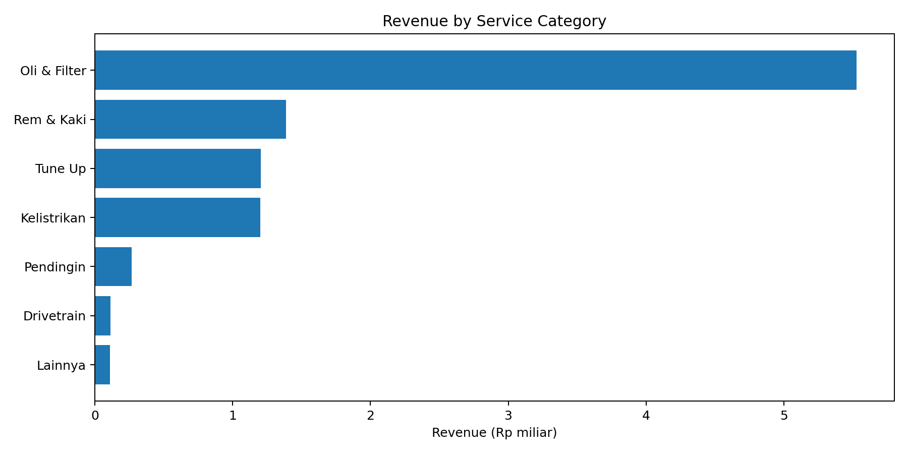
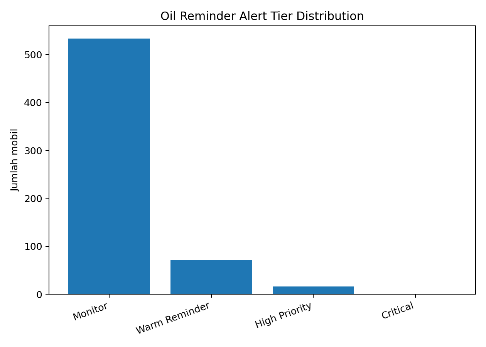
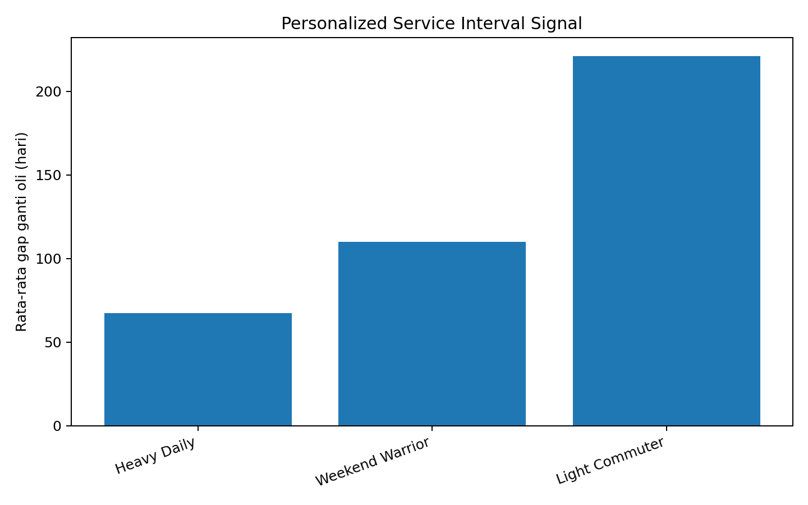
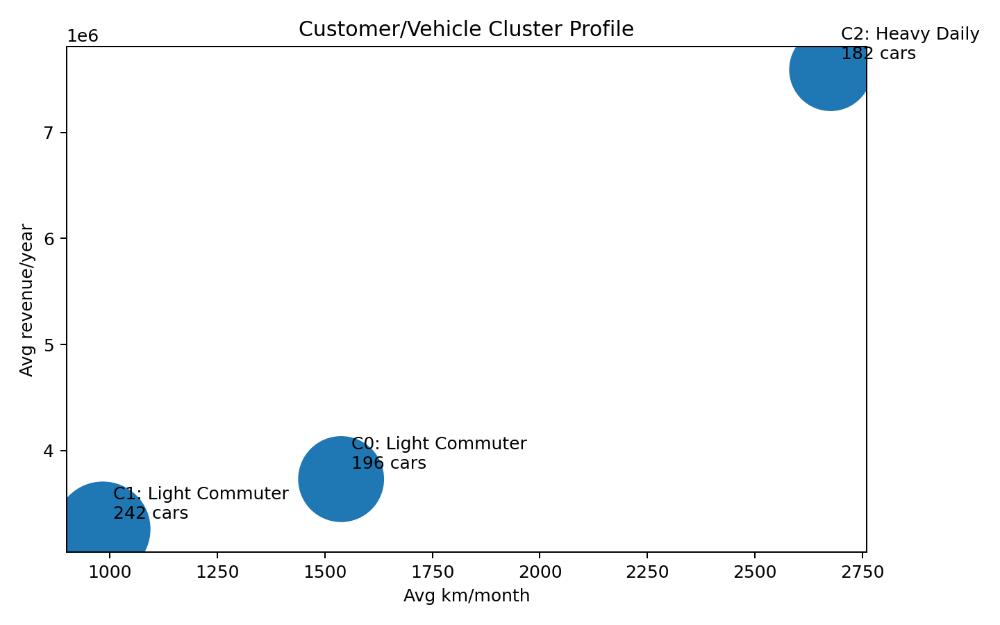
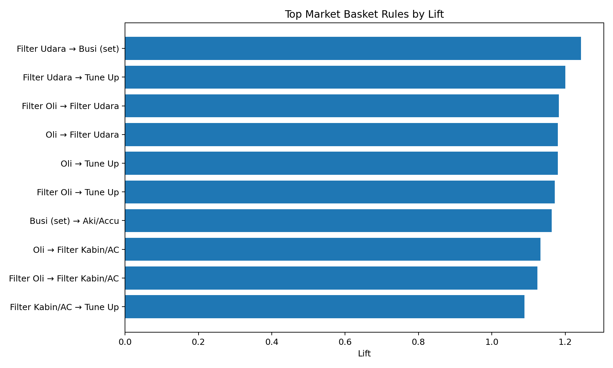
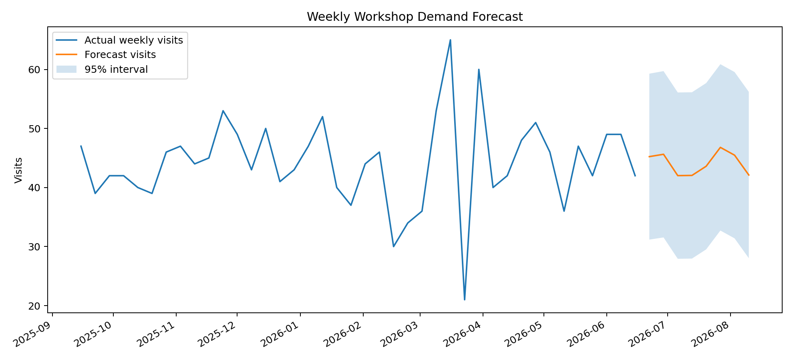

# Smart Workshop Intelligence

**End-to-end data science pipeline for oil service reminders, cross-sell recommendation, demand forecasting, and customer prioritization.**

Author: **Reinhard Halomoan Pane**

---

## Overview

Smart Workshop Intelligence is an end-to-end data science project for a car workshop or automotive dealer. The project transforms vehicle service history into an analytics engine for personalized oil service reminders, cross-sell recommendation, demand forecasting, customer segmentation, and customer value-risk prioritization.

The main idea is to move beyond a simple rule-based oil reminder. Instead of only sending a message when a vehicle reaches a fixed mileage or time threshold, this project builds a data-driven workflow that answers five business questions:

1. Which vehicles should receive a service reminder?
2. Which customers should be prioritized?
3. What additional service items can be offered?
4. How many workshop visits should be expected in the next 8 weeks?
5. Which customer segments generate the highest business value?

The final positioning of this project is:

> Smart Workshop Intelligence is not just an oil reminder model. It is a decision engine that connects customer behavior, service urgency, cross-sell opportunity, and operational capacity into one data science workflow.

---

## Business Problem

Car workshops often rely on static service rules such as mileage-based or calendar-based reminders. This approach is useful, but it treats all vehicles and customers in the same way.

In reality, each vehicle has different usage intensity, mileage behavior, service pattern, and revenue potential. A vehicle used heavily every day should not receive the same reminder logic as a vehicle used only occasionally. Similarly, a high-value repeat customer should not be treated the same as a low-frequency customer.

This project proposes a smarter approach by combining:

* customer profile,
* vehicle profile,
* service transaction history,
* item-level service basket,
* mileage behavior,
* revenue history,
* and visit timing patterns.

The result is a workshop intelligence pipeline that can support marketing, service advisors, operational planning, and management decision-making.

---

## Project Objectives

The objectives of this project are:

* Build a personalized oil service reminder system.
* Score customers and vehicles based on service urgency.
* Identify cross-sell opportunities using market basket analysis.
* Forecast weekly workshop demand for operational planning.
* Segment customers and vehicles based on usage and revenue behavior.
* Produce executive-ready outputs for business users.
* Package the workflow into a reproducible data science repository.

---

## Dataset

The dataset is synthetic and created for demonstration, portfolio, and proof-of-concept purposes. It simulates a Toyota workshop service history in Medan, Indonesia.

The synthetic dataset is generated through `scripts/data_gen.py`. The generator is designed to create realistic analytical signals for:

* personalized oil service interval modeling,
* market basket analysis,
* and workshop demand forecasting.

Main data tables:

| File                           | Description                                         |
| ------------------------------ | --------------------------------------------------- |
| `data/raw/pelanggan.csv`       | Synthetic customer-level information                |
| `data/raw/pelanggan_mobil.csv` | Synthetic customer-vehicle master data              |
| `data/raw/riwayat_servis.csv`  | Synthetic service transaction history at item level |

Dataset scope:

| Metric                 |     Value |
| ---------------------- | --------: |
| Unique customers       |       533 |
| Unique vehicles        |       620 |
| Service visits         |     8,354 |
| Service item rows      |    29,023 |
| Service history period | 2022–2026 |

All names, phone numbers, addresses, and vehicle plate numbers are synthetic. No real customer data is used in this project.

---

## Analytics Workflow

The pipeline follows this structure:

```text
Raw service data
→ Data quality audit
→ Feature engineering
→ Personalized service interval modeling
→ Due alert scoring
→ Market basket analysis
→ Weekly demand forecasting
→ Customer segmentation
→ Customer value-risk scoring
→ Executive outputs
```

The business workflow can be summarized as:

```text
Service history data
→ vehicle service urgency
→ customer prioritization
→ cross-sell recommendation
→ weekly demand planning
→ revenue and retention strategy
```

---

## Methods Used

| Analytics Layer               | Method                                                                  |
| ----------------------------- | ----------------------------------------------------------------------- |
| Data quality audit            | Missing value check, duplicate check, foreign key check                 |
| Feature engineering           | Visit-level aggregation, service interval calculation, revenue features |
| Personalized service interval | Survival-style interval modeling / duration prediction                  |
| WA alert scoring              | Priority score based on time progress, km progress, and due probability |
| Market basket analysis        | Association rules using support, confidence, and lift                   |
| Demand forecasting            | Weekly forecast using lag features and calendar-based features          |
| Customer segmentation         | K-Means clustering                                                      |
| Customer value-risk           | Revenue scoring and recency-risk proxy                                  |
| Executive reporting           | Excel workbook, CSV outputs, Markdown report, and plots                 |

---

## Repository Structure

```text
smart-workshop-intelligence/
│
├── README.md
├── requirements.txt
├── .gitignore
├── LICENSE
│
├── scripts/
│   └── data_gen.py
│
├── data/
│   ├── README.md
│   └── raw/
│       ├── pelanggan.csv
│       ├── pelanggan_mobil.csv
│       └── riwayat_servis.csv
│
├── src/
│   └── smart_workshop_advanced_pipeline.py
│
├── outputs/
│   ├── executive/
│   │   ├── Smart_Workshop_Intelligence_Analysis.xlsx
│   │   └── Smart_Workshop_Intelligence_Report.md
│   │
│   ├── main/
│   │   ├── 07_due_alert_candidates.csv
│   │   ├── 08_market_basket_rules.csv
│   │   ├── 10_weekly_demand_forecast.csv
│   │   └── 14_customer_value_risk.csv
│   │
│   ├── supporting/
│   │   ├── 01_kpi_summary.csv
│   │   ├── 02_data_quality_audit.csv
│   │   ├── 03_revenue_by_category.csv
│   │   ├── 04_revenue_by_item.csv
│   │   ├── 05_oil_interval_by_segment.csv
│   │   ├── 06_interval_model_coefficients.csv
│   │   ├── 09_oil_attach_rates.csv
│   │   ├── 11_forecast_backtest.csv
│   │   ├── 12_cluster_profile.csv
│   │   ├── 13_cluster_confusion.csv
│   │   ├── 15_uplift_scenarios.csv
│   │   └── 16_model_summary.csv
│   │
│   └── plots/
│       ├── plot_revenue_by_category.png
│       ├── plot_alert_tiers.png
│       ├── plot_oil_interval_by_segment.png
│       ├── plot_cluster_profile.png
│       ├── plot_top_basket_rules.png
│       └── plot_weekly_forecast.png
│
└── docs/
    └── 03_interpretation.md
```

---

## Key Outputs

The project outputs are divided into four groups:

| Output Group         | Folder                | Purpose                                                           |
| -------------------- | --------------------- | ----------------------------------------------------------------- |
| Executive output     | `outputs/executive/`  | Business-facing workbook and narrative report                     |
| Main research output | `outputs/main/`       | Core analytical outputs used for decision-making                  |
| Supporting output    | `outputs/supporting/` | Technical validation, audit, model summary, and supporting tables |
| Visualization output | `outputs/plots/`      | Presentation-ready charts for README, report, or slides           |

The most important files for business interpretation are:

| Output                                                        | Description                                                             |
| ------------------------------------------------------------- | ----------------------------------------------------------------------- |
| `outputs/executive/Smart_Workshop_Intelligence_Analysis.xlsx` | Executive workbook containing dashboard, KPI, model tables, and outputs |
| `outputs/executive/Smart_Workshop_Intelligence_Report.md`     | Narrative report summarizing the analytical results                     |
| `outputs/main/07_due_alert_candidates.csv`                    | List of vehicles/customers prioritized for WA reminders                 |
| `outputs/main/08_market_basket_rules.csv`                     | Association rules for cross-sell recommendations                        |
| `outputs/main/10_weekly_demand_forecast.csv`                  | 8-week workshop demand forecast                                         |
| `outputs/main/14_customer_value_risk.csv`                     | Customer value and churn-risk proxy scoring                             |
| `outputs/plots/`                                              | Presentation-ready visualizations                                       |

---

## Key Business Findings

### 1. Revenue Structure

The total simulated revenue is approximately **Rp 9.8 billion**. Oil-related service is the main recurring anchor, but non-oil and cross-sell services contribute around **63.3%** of total revenue.

This means oil service reminders should not only be treated as maintenance notifications. They can become an entry point for additional service revenue.

The key idea is:

```text
Oil service creates the visit.
Additional service categories create the revenue expansion.
```

### 2. Alert Prioritization

The alert scoring model classifies vehicles into four tiers:

| Alert Tier    | Number of Vehicles | Interpretation                                             |
| ------------- | -----------------: | ---------------------------------------------------------- |
| Monitor       |                533 | Not urgent yet; keep in monitoring pool                    |
| Warm Reminder |                 71 | Getting close to service due condition                     |
| High Priority |                 16 | Close to or beyond expected service threshold              |
| Critical      |                  0 | Requires immediate escalation, but none appear in this run |

The actionable group consists of **Warm Reminder** and **High Priority** vehicles. This means only **87 vehicles** should become immediate campaign targets.

This prevents unnecessary mass messaging and helps the workshop focus on customers with higher service urgency.

### 3. Personalized Service Interval

Average oil change interval differs across usage segments:

| Segment         | Average Oil Change Gap |
| --------------- | ---------------------: |
| Heavy Daily     |               ~67 days |
| Weekend Warrior |              ~110 days |
| Light Commuter  |              ~221 days |

This confirms that a single static oil service interval is not enough. Heavy usage vehicles require more frequent reminders, while light commuter vehicles can be handled with a longer reminder cycle.

### 4. Market Basket Opportunity

Market basket analysis shows several relevant cross-sell rules:

```text
Filter Udara → Busi (set)
Filter Udara → Tune Up
Filter Oli → Filter Udara
Oli → Filter Udara
Oli → Tune Up
Filter Oli → Tune Up
```

These rules can be translated into next-best-offer logic in WA reminders or service advisor recommendations.

The strongest business story is:

```text
Oil service is not the end of the transaction.
Oil service is the entry point into a broader service basket.
```

### 5. Demand Forecast

The 8-week forecast estimates approximately **42–47 workshop visits per week**. This helps the workshop plan:

* mechanic capacity,
* booking slots,
* oil stock,
* filter stock,
* and campaign timing.

This makes the project stronger because it does not only focus on customer targeting. It also considers whether the workshop operation is ready to absorb the expected demand.

### 6. Customer Segmentation

The clustering model identifies a high-value **Heavy Daily** segment with higher monthly mileage and higher annualized revenue. This segment should receive more proactive reminders and service package offers.

The cluster output helps the workshop move from vehicle-level decisions to segment-level strategy.

---

## Visualization Interpretation

This section explains the main plots generated by the Smart Workshop Intelligence pipeline. The goal of these visualizations is not only to describe the data, but also to connect each analytical result with a clear business decision.

---

### 1. Revenue by Service Category



The revenue distribution shows that **Oli & Filter** is the dominant service category, contributing approximately **Rp 5.5 billion** or around **56%** of total service category revenue.

This is an important business signal. Oil and filter service acts as the recurring entry point that brings customers back to the workshop. However, the business opportunity is not limited to oil service. Categories such as **Rem & Kaki**, **Tune Up**, and **Kelistrikan** also contribute significant revenue.

From a business perspective, the workshop should not treat oil change reminders as a standalone maintenance notification. Instead, oil reminders should become the starting point for broader preventive maintenance offers.

Example flow:

```text
Oil reminder
→ filter check
→ brake inspection
→ tune up recommendation
→ electrical/battery check
```

This means the reminder system has two roles:

1. bring customers back to the workshop, and
2. create an opportunity for relevant cross-sell.

---

### 2. Oil Reminder Alert Tier Distribution



The alert tier distribution shows that most vehicles are still in the **Monitor** category. A smaller group is classified as **Warm Reminder**, and only a small number of vehicles are classified as **High Priority**. No vehicle falls into the **Critical** category.

This is important because the system is not designed for mass blasting. Instead of sending reminders to all 620 vehicles, the model narrows the actionable target to the vehicles that are most relevant for a campaign.

The business logic is:

```text
Do not contact everyone.
Contact the right customer at the right time.
```

Practical use case:

```text
Monitor
→ keep in database

Warm Reminder
→ send soft reminder

High Priority
→ send stronger reminder with booking suggestion

Critical
→ escalate to service advisor
```

This output turns a simple oil reminder into a prioritization engine.

---

### 3. Personalized Service Interval Signal



The personalized service interval plot shows that oil change behavior differs strongly across usage segments.

The average oil change gap is approximately:

| Segment         | Average Oil Change Gap |
| --------------- | ---------------------: |
| Heavy Daily     |               ~67 days |
| Weekend Warrior |              ~110 days |
| Light Commuter  |              ~221 days |

This confirms that a single static oil reminder rule is not enough. A vehicle used daily with high monthly mileage should not receive the same reminder logic as a vehicle used lightly.

The deeper interpretation is:

```text
The same oil interval rule can create different service urgency depending on vehicle usage behavior.
```

A Heavy Daily vehicle reaches service due much faster because of higher usage intensity. A Light Commuter vehicle may take much longer to reach the same mileage threshold, but still needs time-based monitoring because oil also ages over calendar time.

Recommended reminder strategy:

| Segment         | Recommended Reminder Strategy            |
| --------------- | ---------------------------------------- |
| Heavy Daily     | More frequent reminder cycle             |
| Weekend Warrior | Balanced reminder using mileage and time |
| Light Commuter  | Time-based reminder is more important    |

This is one of the most important analytical layers in the project. It upgrades the system from:

```text
Rule-based reminder
```

into:

```text
Behavior-based service intelligence
```

---

### 4. Customer/Vehicle Cluster Profile



The cluster profile compares customer/vehicle groups using average monthly mileage and average yearly revenue.

The most important cluster is **C2: Heavy Daily**. This cluster has:

* higher average km/month,
* higher average revenue/year,
* and a meaningful number of vehicles.

This means C2 is the most valuable operational segment. These customers use their vehicles more intensively and generate higher annual service value.

The interpretation is:

```text
High usage intensity drives more frequent service demand.
More frequent service demand creates higher customer value.
```

Recommended strategy:

| Cluster            | Strategy                                                |
| ------------------ | ------------------------------------------------------- |
| C2: Heavy Daily    | Prioritize for proactive reminders and service packages |
| C0: Light Commuter | Use moderate reminder frequency                         |
| C1: Light Commuter | Use low-cost automated reminders and periodic check-ins |

The cluster output helps the workshop move from vehicle-level decisions to segment-level strategy.

Instead of only asking:

```text
Which car is due for service?
```

the workshop can also ask:

```text
Which type of customer should receive more attention?
```

---

### 5. Top Market Basket Rules by Lift



The market basket plot shows which service items tend to appear together in the same visit.

Examples of important rules include:

```text
Filter Udara → Busi (set)
Filter Udara → Tune Up
Filter Oli → Filter Udara
Oli → Filter Udara
Oli → Tune Up
Filter Oli → Tune Up
```

These rules are useful because they can be translated into next-best-offer recommendations.

For example, when a customer comes for oil service, the workshop can recommend related preventive maintenance items such as filter udara, filter kabin, or tune up.

However, lift should not be interpreted alone. A rule with high lift is not always the most profitable rule. The best business rule should be selected using a combination of:

```text
support + confidence + lift + estimated revenue
```

Metric interpretation:

| Metric            | Meaning                                                                |
| ----------------- | ---------------------------------------------------------------------- |
| Support           | How often the rule appears                                             |
| Confidence        | How likely the consequent item appears after the antecedent            |
| Lift              | How much stronger the relationship is compared to random co-occurrence |
| Estimated revenue | Business value of the rule                                             |

The better campaign decision is:

```text
Choose rules with enough frequency, reliable confidence, positive lift, and strong revenue potential.
```

This is why the project uses market basket analysis not only as a statistical output, but as a cross-sell decision layer.

---

### 6. Weekly Workshop Demand Forecast



The weekly forecast shows actual weekly visits and predicted visits for the next 8 weeks. The forecast range is approximately **42 to 47 visits per week**, with a 95% prediction interval around the forecast.

This output connects marketing with operations.

A service reminder campaign should not be launched without checking workshop capacity. If too many reminders are sent in the same week, the workshop may face:

* overloaded mechanics,
* limited booking slots,
* insufficient oil/filter inventory,
* longer customer waiting time,
* and lower service experience.

The operational interpretation:

| Forecast Insight                       | Business Use                         |
| -------------------------------------- | ------------------------------------ |
| Stable demand around 42–47 visits/week | Maintain normal mechanic capacity    |
| Forecast oil visits around 36–40/week  | Prepare oil and filter inventory     |
| Wide prediction interval               | Keep buffer capacity for uncertainty |
| Future demand trend                    | Schedule WA reminders gradually      |

The decision flow becomes:

```text
Due alert candidates
→ check weekly demand forecast
→ select campaign volume
→ send WA reminders gradually
→ avoid operational overload
```

This makes the project stronger because it does not only focus on customer targeting. It also considers whether the business operation is ready to absorb the demand.

---

## Integrated Business Interpretation

The six visualizations tell one connected story:

```text
Revenue by category
→ Oil service is the main recurring entry point.

Alert tier distribution
→ Not all customers should be contacted at the same time.

Personalized interval signal
→ Different vehicle usage patterns require different reminder timing.

Cluster profile
→ Heavy Daily customers are more valuable and should be prioritized.

Market basket rules
→ Oil service can trigger relevant cross-sell offers.

Weekly demand forecast
→ Campaign timing must match workshop capacity.
```

The complete business logic is:

```text
1. Identify vehicles that are approaching service due.
2. Prioritize customers based on alert tier and value.
3. Attach relevant next-best-offer using market basket rules.
4. Check weekly demand forecast before launching campaigns.
5. Send reminders gradually to avoid overloading the workshop.
6. Track conversion and update the model in the next cycle.
```

This turns the project into a full workshop intelligence system.

---

## Output Concept and Decision Layer

Each output is designed to answer a specific business decision inside a workshop operation.

| Business Question                      | Output Used                                 | Decision Produced                            |
| -------------------------------------- | ------------------------------------------- | -------------------------------------------- |
| Who should receive a service reminder? | `07_due_alert_candidates.csv`               | Target customer and vehicle list             |
| What should be offered?                | `08_market_basket_rules.csv`                | Cross-sell or next-best-offer                |
| When should the campaign be sent?      | `10_weekly_demand_forecast.csv`             | Campaign timing and weekly capacity planning |
| Which customers matter most?           | `14_customer_value_risk.csv`                | Retention and prioritization strategy        |
| How should executives read the result? | `Smart_Workshop_Intelligence_Analysis.xlsx` | KPI dashboard and model summary              |

The strength of this project is not in one model. The value comes from how each output connects to a business decision.

The final decision flow is:

```text
1. Identify service due candidates.
2. Rank customers by urgency and value.
3. Attach relevant service recommendation.
4. Check workshop capacity forecast.
5. Send targeted reminder.
6. Track booking and conversion.
7. Update customer and vehicle status.
```

---

## Business Impact

This project can support four business functions:

### 1. Customer Retention

The project helps identify customers who are likely approaching service due and customers who may need reactivation.

### 2. Revenue Growth

Oil service reminders can be used as a trigger for cross-sell offers such as filter replacement, tune up, brake inspection, or battery check.

### 3. Operational Planning

The demand forecast helps the workshop prepare mechanics, booking slots, oil stock, filter stock, and service capacity.

### 4. Management Monitoring

The executive workbook summarizes KPI, revenue structure, model output, and business opportunities in one place.

---

## How to Run

Install dependencies:

```bash
pip install -r requirements.txt
```

Run the pipeline:

```bash
python src/smart_workshop_advanced_pipeline.py \
  --input_dir data/raw \
  --output_dir outputs
```

For Google Colab:

```python
!pip -q install lifelines mlxtend statsmodels scikit-learn xlsxwriter openpyxl tabulate

!python -W ignore::DeprecationWarning /content/smart_workshop_advanced_pipeline.py \
  --input_dir /content \
  --output_dir /content/output_swi
```

---

## Tech Stack

* Python
* Pandas
* NumPy
* Scikit-learn
* Lifelines
* Mlxtend
* Matplotlib
* XlsxWriter
* OpenPyXL
* Google Colab
* GitHub

---

## Limitations

This project uses synthetic data, so the results are suitable for portfolio demonstration, proof of concept, and pitch materials. For real implementation, the model should be retrained and validated using actual workshop data.

Several limitations must be noted:

1. The WA reminder impact is not causal yet.
2. The churn-risk score is a recency-based proxy, not a trained churn classifier.
3. Market basket rules show association, not causation.
4. Forecasting is based on historical visit patterns and synthetic calendar effects.
5. Real implementation requires actual booking, campaign, and conversion data.

The WA reminder impact should be tested using A/B testing or randomized campaign rollout to measure true incremental impact.

---

## Next Steps

Future improvements:

* Add real booking conversion data.
* Add actual WA campaign response data.
* Build a true conversion model using historical campaign data.
* Build an API endpoint for real-time alert scoring.
* Add dashboard deployment using Streamlit, Power BI, or Looker Studio.
* Run A/B testing to measure campaign uplift.
* Add inventory forecasting for oil, filters, brake pads, batteries, and tires.
* Convert the scoring pipeline into a scheduled batch job.

The ideal production version would run weekly:

```text
New service data
→ refresh vehicle status
→ score service due probability
→ generate WA target list
→ attach next-best-offer
→ check capacity forecast
→ send campaign
→ track conversion
→ update model
```

---

## Project Status

Completed as a portfolio-ready data science pipeline.
